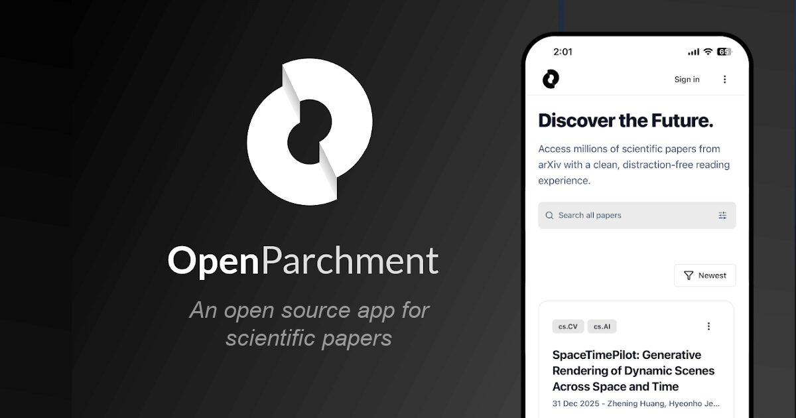
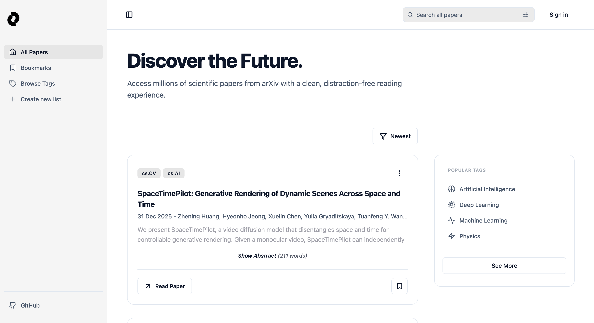

## OpenParchment



## Table of Contents

- [Overview](#overview)
- [Features](#features)
- [Tech Stack](#tech-stack)
- [Getting Started](#getting-started)
- [Configuration](#configuration)
- [Running the App](#running-the-app)
- [License](#license)

## Overview

OpenParchment helps you browse, bookmark, and read arXiv papers. Firebase authentication is required for the Bookmarking and List functionality (but could easily be removed).



## Features

- 🔍 **Advanced search** for arXiv papers with detailed filters
- 📑 **Bookmarks & Lists** synced when Firebase credentials are present
- 👤 **Authentication** required for Bookmarks & Lists
- 🎨 **Theming** dark-mode compatible
- 📱 **Multi-platform**: iOS, Android, and web in a single codebase

## Tech Stack

- [Expo](https://expo.dev/) + [React Native](https://reactnative.dev/)
- [React Navigation](https://reactnavigation.org/) for routing
- [Firebase](https://firebase.google.com/) (optional) for authentication

## Getting Started

1. **Install dependencies**
   Run install in both /functions and the root
   ```bash
   npm install
   ```
2. **Configure environment variables** (see [Configuration](#configuration)).
3. **Run the app** (see [Running the App](#running-the-app)).

## Configuration

To enable Authentication, Bookmarking, and Lists in your own instance:

1. Set up a Firebase project
2. Enable Firestore
3. Create a .env file at the project root with your corresponding values for your Firebase config:

```bash
EXPO_PUBLIC_FIREBASE_API_KEY=...
EXPO_PUBLIC_FIREBASE_AUTH_DOMAIN=...
EXPO_PUBLIC_FIREBASE_PROJECT_ID=...
EXPO_PUBLIC_FIREBASE_STORAGE_BUCKET=...
EXPO_PUBLIC_FIREBASE_MESSAGING_SENDER_ID=...
EXPO_PUBLIC_FIREBASE_APP_ID=...
```

- Note that Expo requires Firebase variables to use the `EXPO_PUBLIC_` prefix

## Running the App

```bash
npx expo start
```

Follow the Expo bundler instructions to open the iOS simulator, Android emulator, or web view. For the best native experience on device, install the Expo Go app.

## License

This project is licensed under the MIT License. See [LICENSE](LICENSE) for details.
